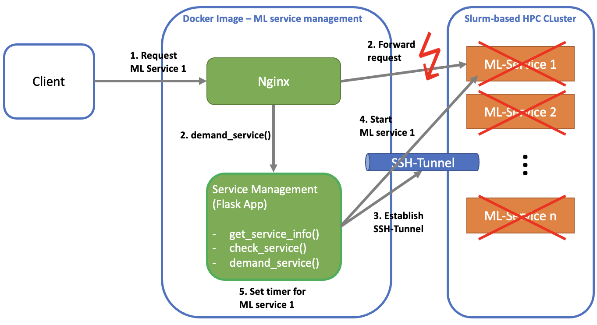
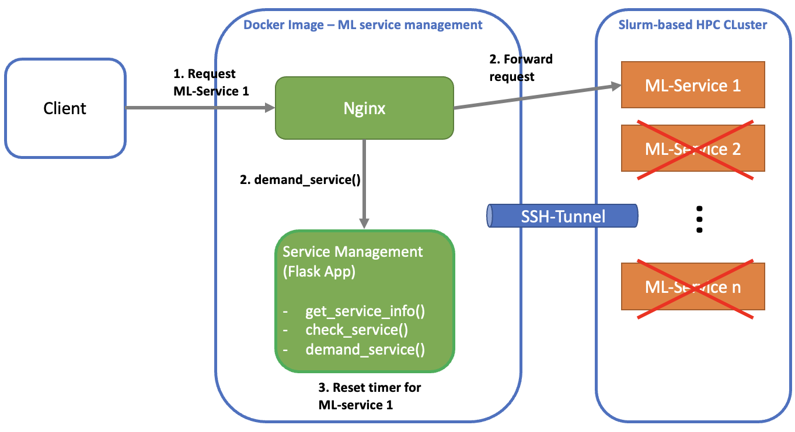

# System Workflow for Client Requests

In this document, we describe the workflow of handling client requests in the ML service management system using Nginx and Flask.

## Request Handling Workflow

# Request Handling Workflow - Scenario 1

In this scenario, we outline the workflow for handling a client request when ML-Service 1 is not running.

1. **Client Request for ML-Service 1**:
   - A user/client submits a request for ML-Service 1.

2. **Nginx Proxy Pass Error**:
   - Nginx forwards the request via proxy_pass to the corresponding URL.
   - However, an error occurs as ML-Service 1 is not yet running.

3. **Invocation of demand_service() Function**:
   - Simultaneously, the demand_service() function of the Flask app is invoked.

4. **Establishment of SSH Tunnel**:
   - The Flask app establishes an SSH tunnel between the container and the target server for the corresponding port of ML-Service 1.

5. **Start of Slurm Job**:
   - The Flask app initiates the Slurm job on the target server, which executes ML-Service 1.

6. **Start of Timer for ML-Service 1**:
   - The Flask app starts the timer for ML-Service 1, defining how long the service will continue to run if no new requests are received.

### 2. Timeout Management Workflow

# Request Handling Workflow - Scenario 2

In this scenario, we outline the workflow for handling a client request when ML-Service 1 is already running.

1. **Client Request for ML-Service 1**:
   - A user/client submits a request for ML-Service 1.

2. **Nginx Proxy Pass**:
   - Nginx forwards the request via proxy_pass to the corresponding URL.

3. **Invocation of demand_service() Function**:
   - Simultaneously, the demand_service() function of the Flask app is invoked.

4. **Resetting Timer for ML-Service 1**:
   - The timer for ML-Service 1 is reset, indicating that the service is still active and handling requests.

## Conclusion

Summarize the key points of the request handling workflow and emphasize the benefits of using Nginx and Flask for managing ML services efficiently.

## Next Steps

Consider adding additional diagrams or expanding the description to cover other aspects of the system's functionality or architecture.

